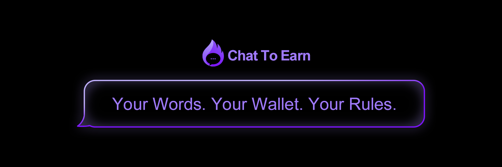

---

## I Build Blockchain & AI Solutions

*Specialized in Solana ecosystem development and cutting-edge AI/ML systems*

<table>
<tr>
<td width="33%" align="center">

### 🔗 **Blockchain Protocols**
*Rust/Anchor frameworks optimized for performance and security*

**Key Features:**
- Gas-optimized smart contracts
- Multi-signature security
- Comprehensive testing
- Audit-ready architecture

</td>
<td width="33%" align="center">

### 🤖 **AI/ML Systems**
*Neural networks and machine learning models for real-world applications*

**Key Features:**
- Custom model development
- Real-time inference APIs
- Performance optimization
- Scalable deployment

</td>
<td width="33%" align="center">

### 🚀 **Full-Stack Integration**
*Complete applications bridging blockchain and AI technologies*

**Key Features:**
- Real-time data feeds
- Wallet integration
- AI-powered features
- Performance monitoring

</td>
</tr>
</table>

---

## How I Do It

*My proven development process ensures security, performance, and scalability*

<table>
<tr>
<td width="33%" align="center">

### 🗃️ **Phase 1: Build**
*Architecture design and core development foundation*

**Key Activities:**
- Security-first architecture
- Smart contract optimization
- AI model development
- Comprehensive testing
- Code documentation

*Timeline: 2-4 weeks*

</td>
<td width="33%" align="center">

### 🔗 **Phase 2: Integrate**
*System integration and frontend/backend connectivity*

**Key Activities:**
- Web3 wallet integration
- AI inference APIs
- Real-time data feeds
- Performance optimization
- Cross-platform compatibility

*Timeline: 3-6 weeks*

</td>
<td width="33%" align="center">

### 📈 **Phase 3: Scale**
*Production deployment and performance monitoring*

**Key Activities:**
- Mainnet deployment
- AI model deployment
- Performance monitoring
- Security auditing
- Ongoing support

*Timeline: 1-2 weeks*

</td>
</tr>
</table>

---

## Featured Projects

*Real-world applications showcasing blockchain + AI integration*

<table>
<tr>

<td width="100%" align="center">

### 💬 **Chat2Earn**

**Decentralized Communication Protocol**

- **Security:** End-to-end encryption
- **Access:** NFT-gated channels
- **Network:** Multi-chain support
- **Tech:** Solana, TypeScript, WebRTC

</td>

</tr>
</table>

---

## Tech Stack & Performance

*Technologies I use to build cutting-edge solutions*

### **Blockchain Technologies**

### **AI/ML Technologies**

### **Infrastructure & Tools**

<table>
<tr>
<td width="50%">

</td>
<td width="50%">

</td>
</tr>
</table>

---

## Get In Touch

*Ready to build the future of technology?*

<table>
<tr>
<td width="50%" align="center">

### 📊 **Expertise**
**Blockchain + AI Development**

✅ Smart Contract Development 
✅ AI/ML Model Creation 
✅ Full-Stack Integration 
✅ Security-First Approach 
✅ Performance Optimization

</td>
<td width="50%" align="center">

### 💰 **Investment of Time**
**Starting at $25,000**

✅ Complete development solution 
✅ Security audit included 
✅ AI/Blockchain integration 
✅ Frontend application 
✅ 6 months support

</td>
</tr>
</table>

---

## Bring your business to the future

*Join the blockchain + AI revolution with cutting-edge technology solutions*

---

## FAQs

<strong>How long does development take?</strong>

 
Typical blockchain protocol development takes 8-12 weeks from concept to mainnet deployment. AI/ML projects range from 4-8 weeks depending on complexity, including model training, testing, and deployment.

<strong>What technologies do you specialize in?</strong>

 
I specialize in Solana blockchain development (Rust/Anchor) and also work with Ethereum, Polygon, and other EVM chains. For AI, I focus on PyTorch, TensorFlow, and custom neural network architectures for real-world applications.

<strong>Do you provide ongoing support?</strong>

 
Yes, I offer 6 months of post-launch support including bug fixes, performance optimization, feature updates, and model retraining for AI systems.

<strong>Can you integrate AI with blockchain?</strong>

 
Absolutely. I specialize in building hybrid systems that combine blockchain security with AI intelligence - from AI-powered trading algorithms to decentralized ML inference networks.

<strong>What's included in a security audit?</strong>

 
My security audits include manual code review, automated vulnerability scanning, gas optimization analysis, and a comprehensive report with remediation recommendations for both smart contracts and AI model security.

---

